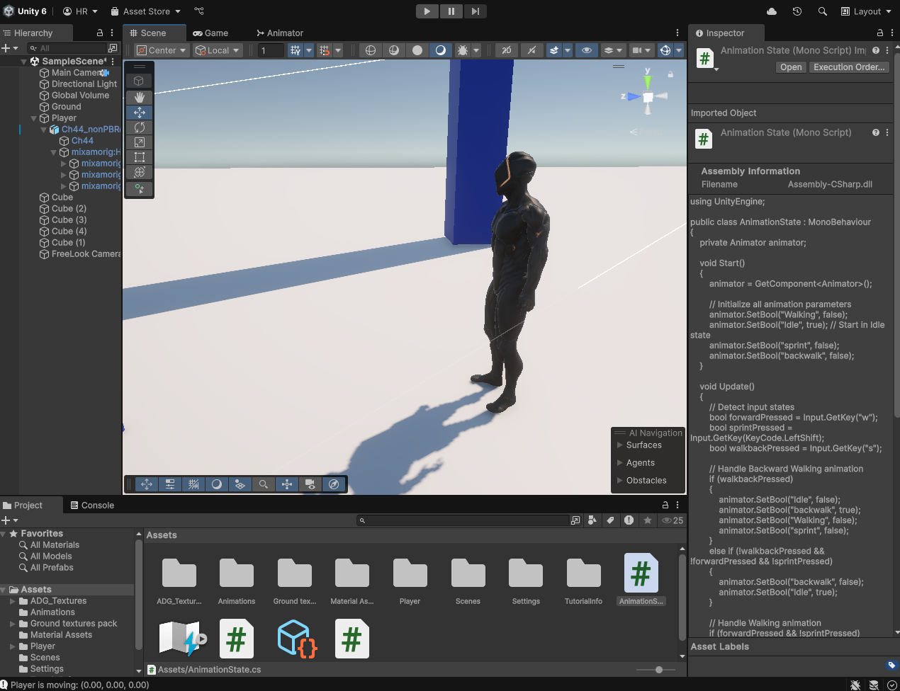

# **3D Player Control Preset with Realistic Movement in Unity 🎮** 

This project provides a **ready-to-use 3D player controller** with realistic movement mechanics and animations in Unity. Designed for beginners and intermediate developers, it serves as a foundation for games requiring precise and smooth character controls. 

**Download Models ->** [Mixamo Characters](https://www.mixamo.com/#/?page=1&type=Character)

**Download Animations ->** [Mixamo Animations](https://www.mixamo.com/#/?page=1&type=Motion%2CMotionPack)

### Features ✨  
- **Smooth forward and backward movement** with customizable speed.  
- **Idle, Walk, Sprint, and Backwalk animations** seamlessly integrated.  
- **Animation transitions** with realistic pacing and responsiveness.  
- Easy-to-understand **script architecture** for player control and animation handling.  
- Modular design for quick customization and expansion.  

### Highlights  
- Rigidbody-based or `transform.Translate`-based movement (flexible implementation).  
- Works perfectly in **third-person perspective**, with optional camera-follow scripts.  
- Supports **animation blend states** for more immersive character control.  

### How to Use 🚀  
1. Clone or download the repository.  
2. Open it in Unity (2021 or later recommended).  
3. Assign your character model and animations in the **Animator Controller**.  
4. Attach the provided scripts to your player GameObject.  
5. Customize movement speed, animation states, and controls to suit your project.  

### Future Improvements 💡  
- Add strafing and diagonal movement.  
- Include jumping and crouching mechanics.
- More Coming In Future.

Feel free to fork, modify, or contribute to this project. Let's create amazing games together! 🎉  
